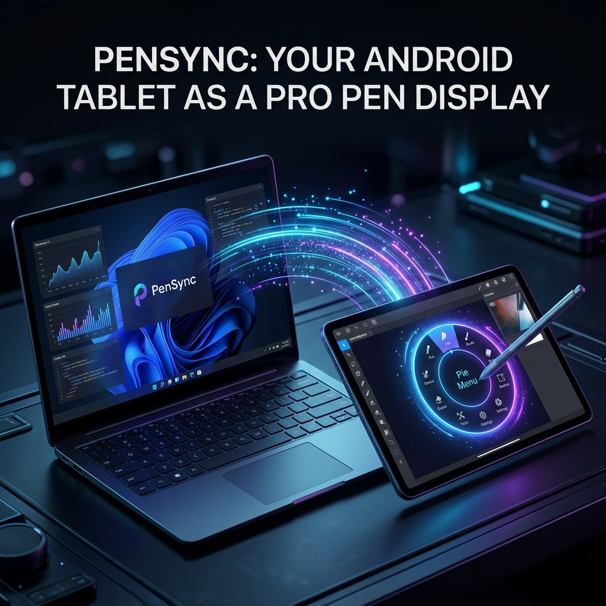

# PenSync - Turn your Android Tablet into a Pro Pen Display

PenSync allows you to seamlessly use your Android tablet as a high-performance graphics tablet for your Windows PC, completely free and wireless! 

**Developer:** Ankit Raj  
**Feedback & Support:** ar443203@gmail.com

---

## 🎨 Features
- **Zero-Lag Telemetry:** Experience sub-millisecond pen tracking with our custom UDP telemetry engine.
- **Dynamic Pie Menu:** Hover over your favorite Windows app (e.g. Photoshop or Blender) and your tablet instantly loads contextual tools and shortcuts as a draggable radial dial.
- **True Driverless Mode:** Runs seamlessly in user-space without the need to install buggy virtual drivers.
- **Pure Trackpad Mode:** Deselect Left/Middle/Right tools on your tablet to enable full multi-finger pinch-to-zoom and panning directly from the tablet glass!

## 🚀 How to Install & Connect

### 1. Windows Installation
- Download and double-click `PenSync_Setup.exe` from this repository.
- Follow the wizard to install PenSync to your PC.
- PenSync will automatically start in the background as a seamless service when you sign into Windows.

### 2. Tablet Installation
- Install `PenSync.apk` on your Android tablet.

### 3. Connecting via USB (Recommended for Zero-Latency)
1. Connect your Android tablet to your PC using a high-quality USB cable.
2. Ensure **USB Debugging** is enabled in your tablet's Android Developer Options.
3. Open the PenSync app on your tablet.
4. The Windows application will automatically detect the USB connection and route the high-speed telemetry locally. 
5. You are ready to draw!

### 4. Connecting via Wi-Fi (Wireless Mode)
1. Ensure both your Windows PC and Android tablet are connected to the **exact same Wi-Fi network**.
2. Open the PenSync app on your tablet.
3. The tablet will automatically broadcast its presence to the PenSync Windows background service over UDP.
4. Once paired, you can disconnect the USB cable and draw completely wirelessly!

---

*This application is protected against unauthorized tampering. Feedback is always welcome, feel free to contact the developer!*

---

###### Keywords for Search: 
*Use Android tablet as drawing monitor, Wacom alternative, Huion alternative, free SuperDisplay alternative, Duet Display alternative, spacedesk, driverless pen display, Windows zero-lag drawing tablet, digital art tools, productivity, graphic design setup, stylus tracking, radial menu.*
